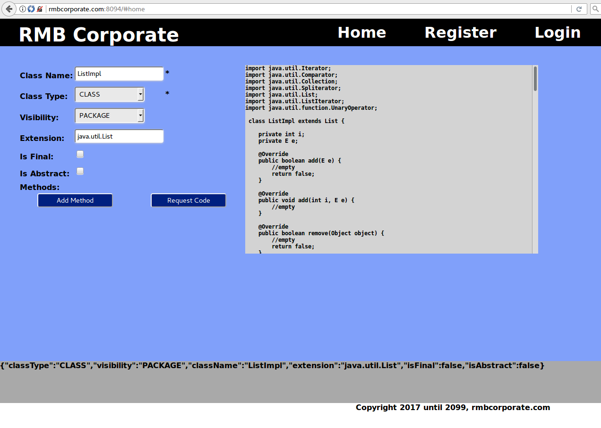

# com.rmbcorp.javawriter.JavaWriter

[](https://travis-ci.org/robertbrako/JavaWriter)
<br>
Utility to dynamically write and compile java code.


## Summary

A Java code generator that is focused on being a useful library underneath more ambitious code-generating projects.
API is being finalized still, but essentially we have two lambdas.  A Processor takes in a Clazz object and outputs a
ProcessResult (java source code + error report).  A Compiler accepts a BuildJob and returns a CompileResult (className +
error report).

## Use cases

Out of the box, JavaWriter is suitable for stubbing classes from interfaces and creating Beans commonly used for database mapping.

## Roadmap

Goals for 0.2-SNAPSHOT:
  1. Validation backed by Unit Tests
  2. Auto-creation of fields
  3. Separating class bean from class processing
  4. 100% method coverage for tests

Goals for 0.3:
  1. Try implementing automated javac for JavaWriter output
  2. Accept command-line parameters.  Minimum scope:
     1. Class name
     2. Class type
     3. Visibility
     4. .java source destination directory
     5. .class javac destination directory
  3. Ability to create if statements

Goals for 0.4:
  1. Improve API; easy package name setting and option to compile only
  2. Support adding custom methods
  3. Support bean creation: getters and setters

Goals for 0.5
  1. Refinements needed for robust class building, to include:
     1. enum creation
     2. pre-method and inline comments
  2. Save compilation errors to CSV file
  3. Handle parametrized types

Goals for 0.6 and above might not be disclosed.

## Proposed API for Private Version

```
{
  "BuildJob": {
    "relpath": "src/test/gen",
    "binpath": "src/test/bin",
    "classpath": "javax/servlet/javax.servlet-api/3.1.0/javax.servlet-api-3.1.0.jar",
    "com": {
      "rmbcorp": {
        "javawriter": {
          "JunitServlet": {
            "classType": "CLASS",
            "visibility": "PUBLIC",
            "extension" : "javax.servlet.http.HttpServlet",
            "methods": [
              {
                "name" : "doGet",
                "visibility" : "protected",//currently, protected is unsupported
                "paramTypes" : [ "javax.servlet.http.HttpServletRequest", "javax.servlet.http.HttpServletResponse" ]
              },
              {
                "name": "setUserId",
                "returns": "Void",
                "visibility": "PUBLIC",
                "isFinal" : "true",
                "paramTypes": [
                  "Integer"
                ]
              },
              {
                "name": "getUserId",
                "returns": "String",
                "visibility": "PUBLIC"
              }
            ],
            "beanvariables" : [ ["username", "String"], ["password", "String"], ["joinDate", "Date"] ]
          }
        },
        "classes": []
      }
    }
  }
}
```